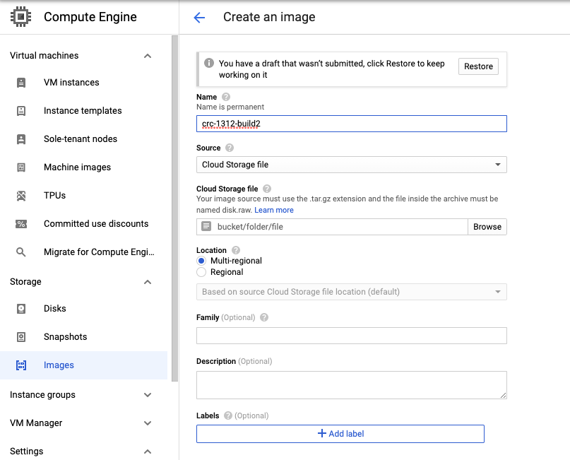

# OpenShift images for Instruqt

This is a work-in-progress doc where we are sharing our own experiences of building a CRC/OpenShift image for the Instruqt platform using Packer/GCE.

## Extracting qcow2 and generating a vmdk image

Once you download [CRC](https://developers.redhat.com/products/codeready-containers/overview) on your machine and do a `crc setup`, the binary extracts a qcow2 image on your machine (refer to the exact path in the command below). Google Compute Engine expects a vmdk image rather than a qcow2 image so use the following command for conversion:

```
$ qemu-img convert -f qcow2 -O vmdk -o subformat=streamOptimized,compat6 ~/.crc/cache/crc_libvirt_4.8.4/crc.qcow2 crc-1.31.vmdk
```

## Getting the local vmdk image to GCE images

In order to upload the resulting image to google cloud storage, from your Google project, navigate to **Storage** --> **Cloud Storage** --> **Browser**

Following the default settings, create a bucket. 

Once inside the bucket, you can upload files and select the vmdk image from the previous step.

Once the vmdk file is uploaded, from Google Compute Engine --> Storage --> Images --> Create Image and follow the screenshot below to import the image from the bucket.



Once the image is successfully import, you'll be able to view it from the following command:

```
gcloud compute images list
```

:costruction: It is important to set the image family name. In the packer file, image family name can be used instead of the exact image name. For example, if Packer cannot find an image called *crc-13120build2* under your GCE images, it can search from all the images that match a family name *crc*. 

## Google Cloud and Packer setup

Instruqt runs their VMs on [GCE](https://cloud.google.com/compute) and they use [Packer](https://www.packer.io/) If you haven't already, create a Google Cloud account and download/install Packer.

This guide assumes that you're executing the commands from your own terminal and not the Google Cloud console terminal (which already authenticates you). 

GCloud Pre-requisites:

1. python3.8 or newer is required. reboot after installing python3
2. install the gcloud client (brew or rpm)
3. Create a new project for this work in Google Cloud
4. run `gcloud init` to authenticate and select your project id
5. Check to make sure you have the following services enabled:
  * https://console.cloud.google.com/marketplace/product/google/compute.googleapis.com
  * https://console.cloud.google.com/marketplace/product/google/cloudbuild.googleapis.com
6. Create a custom service account for Packer and assign it 'Compute Instance Admin (v1)' & 'Service Account User' roles. Name: packer-svc-account

## Configuring a GCloud serviceaccount

Create a new service account? (packer-svc-account)

```
$ export PROJECT=YOUR_PROJECT_ID

$ gcloud iam service-accounts create packer-svc-account \
  --project $PROJECT \
  --description="Packer Service Account" \
  --display-name="Packer Service Account"

$ gcloud projects add-iam-policy-binding $PROJECT \
    --member=serviceAccount:packer-svc-account@$PROJECT.iam.gserviceaccount.com \
    --role=roles/compute.instanceAdmin.v1

$ gcloud projects add-iam-policy-binding $PROJECT \
    --member=serviceAccount:packer-svc-account@$PROJECT.iam.gserviceaccount.com \
    --role=roles/iam.serviceAccountUser

$ gcloud projects add-iam-policy-binding $PROJECT \
    --member=serviceAccount:packer-svc-account@$PROJECT.iam.gserviceaccount.com \
    --role=roles/iap.tunnelResourceAccessor

$ gcloud iam service-accounts keys create packer-svc-account-instruqt-keys.json --iam-account=packer-svc-account@$PROJECT.iam.gserviceaccount.com

$ export GOOGLE_APPLICATION_CREDENTIALS=packer-svc-account-instruqt-keys.json
```

---

The latest build preview available here: https://storage.googleapis.com/crc-vm/crc-1.31.vmdk
